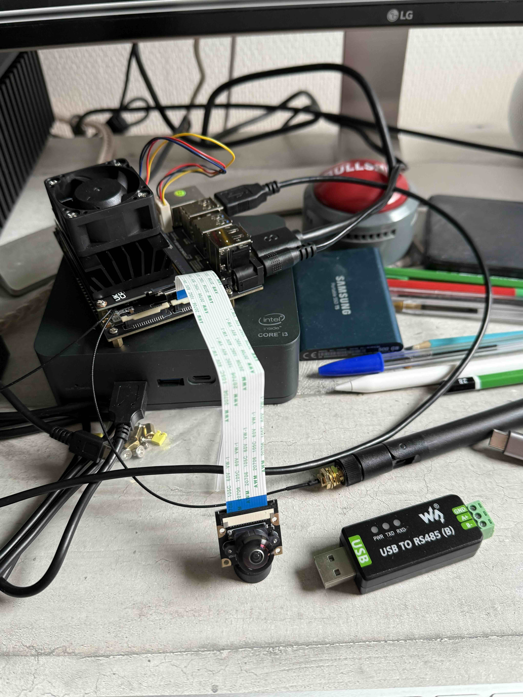
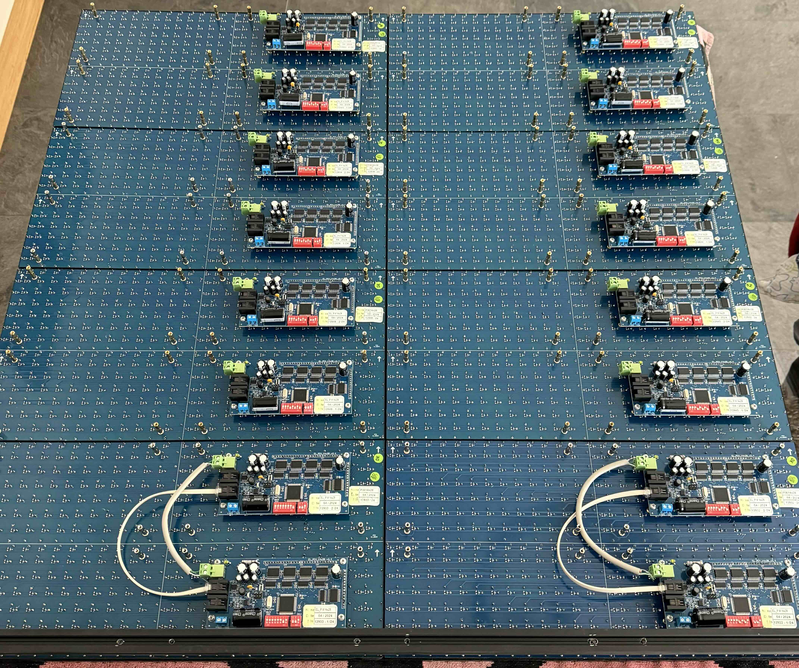
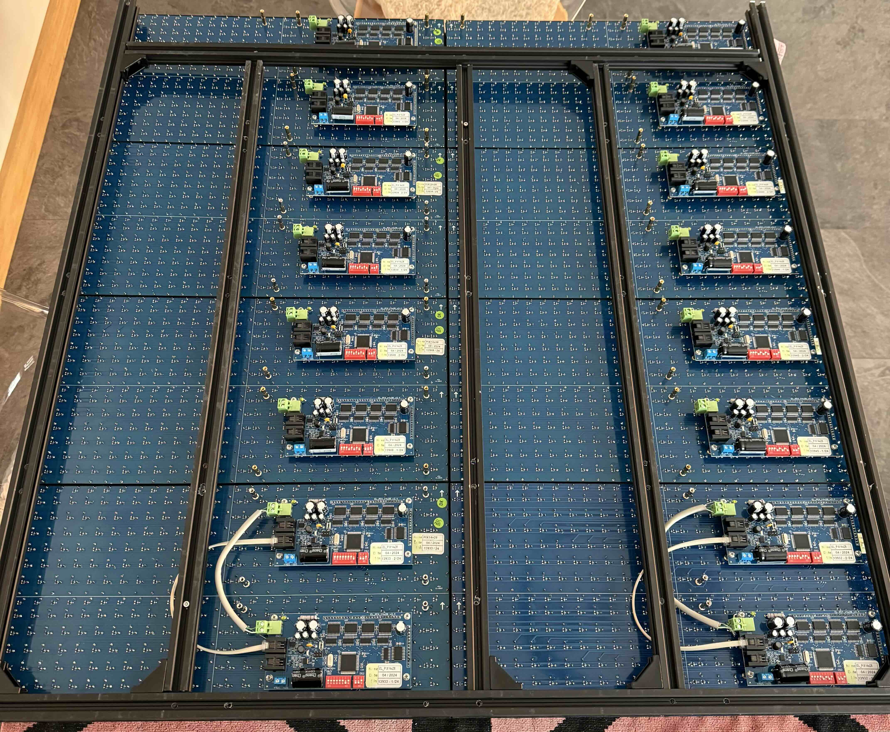

# A fun DIY project: Flipdot panels

## The birth of the Flipdot panels

### The idea

In 2022, in Los Angeles, I saw the work of a NYC art studio called Breakfaststudio. And I was blown away. In the age of IMAX, 8k, 4k displays they chose to make art display with binary state dots panels. They are really doing nice things. Check their work [here](https://breakfaststudio.com) or on YouTube.

I thought it was a cool idea to replicate and a very cool DIY project. So I started to look around and gather information on the Internet.

### Technical stuffs

#### Panels

Not many companies are making flipdots panels nowadays. One of the leader is AlfaZeta from Poland.

They are providing panels in different size. I pick the 28x14 dots model (which is in fact two base 28x7 panels put together).

So one panel is a 28x14 dots matrix basically. It means two controllers per pannel.

Panels are driven with RS485 serial protocol. For small setup, one RS485 main controller interface can drive up to eight controllers. Which in my case means four panels per main controller interfaces.

#### Frame structure

The frame to display information is:

0x80> start of the frame

0x83: command (there are several commands but this one instruct to display on the panel and refresh it)

addres of the panel: each panel has and must have its own address

data: One byte is a stripe of dots (so 7 dots). Least Significant Bit (LSB) is the upper dot. Most Significant Bit (the 7th) is the lower dot. (MSB 8th is ignored and should be put to zero)

0x8F: end of the frame

### The hardware

#### Computing

Jetson Nano with:
* a camera
* two USB to RS485 controllers
* WIFI interface

#### Panels

Flidot panels are AlfaZeta panels, 28x14 dots size

## Some pictures of the construction

## Some examples of what you can get

